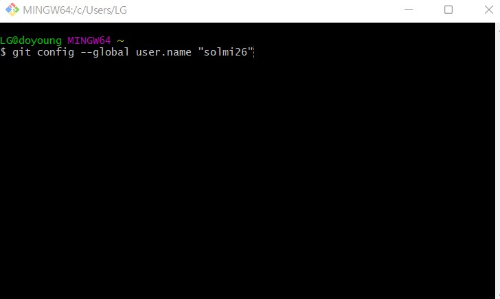

# git/github 여기서 끝내자! – 실습

## **Git 설치 & 환경설정 🔍**

1. Git 설치하기: https://git-scm.com/

2. 설치 완료 후 Git bash 열기

3. git bash에서 환경설정 하기

\- Step 1: 유저이름 설정

**git config --global user.name "your_name"**

\- Step 2: 유저 이메일 설정하기

**git config --global user.email "your_email"**

Github가입시 사용한 이메일을 써주세요!

\- Step 3: 정보 확인하기

**git config –list**

## **Github에 처음 코드 업로드하기 🏋️‍♂️**

1. 초기화

**- git init**

2. 추가할 파일 더하기

**- git add .**

.은 모든 파일이라는 뜻, 선택적으로 올리고 싶으면 add 뒤에 파일 이름 붙여주면 됨.

ex) git add file_name.html

3. 상태 확인 (선택사항)

**- git status**

4. 히스토리 만들기

**- git commit -m "first commit"**

m 은 메세지의 준말로 뒤의 “” 안에 주고 싶은 히스토리 이름을 주면 됨.

5. Github repository랑 내 로컬 프로젝트랑 연결

**- git remote add origin https://github.com/bitnaGithub/firstproject.git**

이 명령어는 github에서 복사해서 붙여 와야 함

6. 잘 연결됐는지 확인 (선택사항)

**- git remote -v**

내가 연결한 주소 값이 잘 뜨면 성공!🎇

7. Github로 올리기

**- git push origin master**

master 자리에는 branch이름이 들어가면 됨 branch이름이 main라면 git push origin main 이라고 써야함.

## **Github에 계속 업데이트 하는 법 🤹‍♂️**

1. 추가할 파일 더하기

**- git add .**

2. 히스토리 만들기

**- git commit -m "first commit"**

3. Github로 올리기

**- git push origin master**

내 컴퓨터에 있는 소스코드를 깃허브에 업데이트하고 싶으면 이 세번의 스텝만 계속 반복하면 됨.

## **Github로 팀프로젝트 하는법 👨‍👩‍👧‍👦**

1. Github에서 소스코드 다운로드

**- git clone 주소 폴더이름**

주소는 깃허브에서 가져 와야 함.

폴더이름은 선택사항이다. (즉, 없어도됨)

폴더이름을 줄 경우에는 그 폴더가 새로 생성이 되면서 그 안에 코드들이 다운로드 되고, 폴더이름을 안주는 경우에는 깃허브 프로젝트 이름으로 폴더가 자동 생성되고 그 안에 코드들이 다운된다.

2. Github에서 내 브랜치(branch)만들기

\- **git checkout -b 브랜치이름**

3. 내 브랜치에 소스코드 업데이트하기

**- git add .**

**- git commit -m "first commit"**

**- git push origin 브랜치이름**

4. 마스터 브랜치에 소스 가져오기(pull)

**- git pull origin master**

pull을 하기전에는 기존에 소스코드들을 먼저 commit 해놔야 한다.

5. 브랜치끼리 이동하는 법

**- git checkout 브랜치이름**

## 출처

<https://hackmd.io/@oW_dDxdsRoSpl0M64Tfg2g/ByfwpNJ-K>

강의 1탄 👩‍🏫: https://youtu.be/lelVripbt2M

강의 2탄 👩‍🏫: https://youtu.be/cwC8t9dno2s
